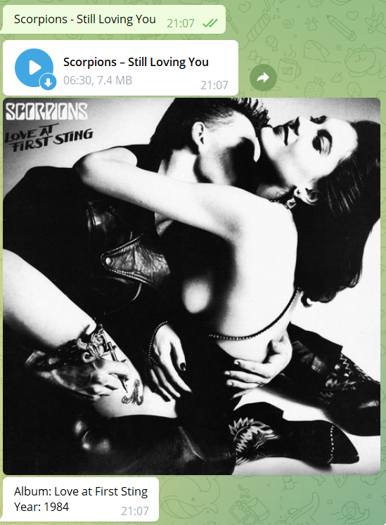

# Описание проекта
ScorpionsBOT - это бот в telegram, созданный в качестве ***средства отработки навыков GoLang***, ну и для души :)

Алгоритм его работы таков: клиент пишет название песни Scorpions в соответствии с указанным шаблоном, бот в ответ кидает ему следующие параметры:
- ***песню в формате .mp3***
- ***название альбома, из которого эта песня***
- ***год выпуска альбома***

Предусмотрены команды ***/start*** и ***/help***, в дальнейшем возможно добавление других команд. 

Всевозможные "неправильные" запросы предусмотрены, так что бот никогда не словит ***panic*** и на каждое сообщение клиента, независимо от его валидности, будет ответ.

Ник в telegram : ***@scorpions_bot***

# Пример работы

